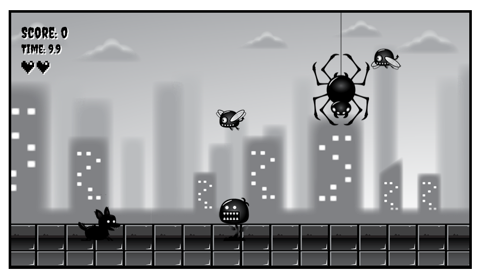
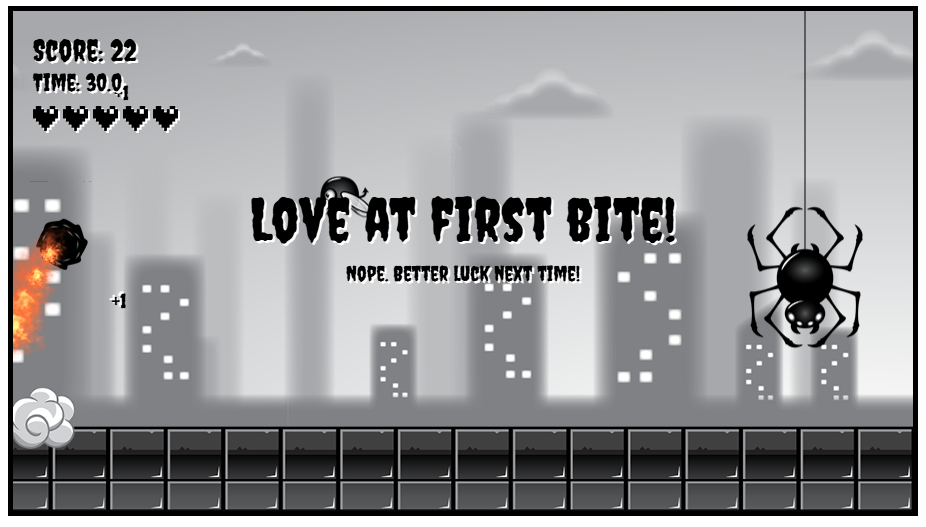

# Game Instructions

Welcome to the game! In this side-scrolling action game, you'll control a character that can run, jump, roll, dive, and more. Follow these instructions to master the gameplay.

## 📷 Screenshots

    
    

## Running 
To run use **Live Server** (or similar) in VS Code.

## 🕹️ Controls

Use your **keyboard arrow keys** and **Enter** to control your character:

- **Arrow Right / Arrow Left**: Start running in the respective direction.
- **Arrow Down**:
  - While running: Sit down.
  - While jumping or falling: Dive downward.
- **Arrow Up**: Jump (if you're on the ground).
- **Enter**:
  - While sitting or running: Start rolling.
  - While jumping or falling: Start rolling in the air (if combined with Enter).
  - While on the ground and diving: Start rolling.

## 🎮 Character States

The player can be in one of the following states:

1. **Sitting**  
   - Default idle state.
   - Use Arrow Right/Left to start running.
   - Press Enter to roll.

2. **Running**  
   - Use Arrow Down to sit.
   - Use Arrow Up to jump.
   - Use Enter to roll.
   - Running leaves a dust trail.

3. **Jumping**  
   - Initiated from Running using Arrow Up.
   - Use Enter to roll in the air.
   - Use Arrow Down to dive.

4. **Falling**  
   - Transitioned to after a jump.
   - If the player hits the ground, they return to Running.
   - Can roll mid-air with Enter or dive with Arrow Down.

5. **Rolling**  
   - Initiated from Sitting, Running, Jumping, or Falling using Enter.
   - If Enter is released:
     - On ground → return to Running.
     - In air → start Falling.
   - Use Arrow Up + Enter on ground to jump from roll.
   - Can dive with Arrow Down if in air.
   - Leaves behind a fire trail.

6. **Diving**  
   - Initiated in air using Arrow Down.
   - On ground impact:
     - Creates a splash effect.
     - Transitions to Running.
   - Can transition to Rolling if Enter is pressed on ground.

7. **Hit**  
   - Triggered by external events (e.g., collision).
   - Plays a hit animation.
   - Automatically transitions to Running (if on ground) or Falling (if in air) after animation.

## ✨ Visual Effects

- **Dust**: Triggered while Running.
- **Fire**: Triggered while Rolling or Diving.
- **Splash**: Triggered when landing after Diving.

## 🧠 Tips

- Use roll strategically to avoid or pass through hazards.
- Combine Enter and Arrow Up for an extra jump boost from the ground.
- Dive when falling to transition quickly and cause splash effects.

Enjoy playing and mastering the different moves of your character!
